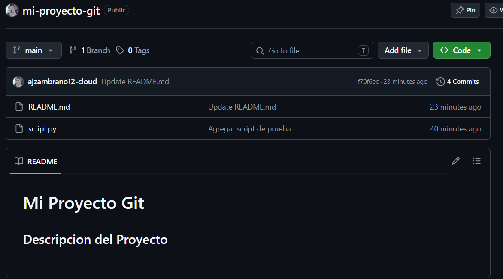

# Control de Versiones con Git y GitHub
### Creación de un repositorio local y sincronización remota

**Estudiante:** Angeles Zambrano  
**Asignatura:** CERN  
**Actividad:** Registro de cambios con Git y publicación en GitHub  
**Repositorio:** [https://github.com/ajzambrano12-cloud/mi-proyecto-git.git](https://github.com/ajzambrano12-cloud/mi-proyecto-git.git)  
**Institución:** Universidad de las Fuerzas Armadas – ESPE (Sangolquí – Ecuador, 2026)

---

## 1. Aprendizajes obtenidos

Durante el desarrollo de esta actividad se consolidaron varios conceptos fundamentales sobre el manejo de repositorios. En primer lugar, se comprendió el flujo básico de trabajo de Git: inicializar un repositorio, preparar los archivos mediante el área de staging con `git add` y confirmar los cambios de forma permanente mediante `git commit`, generando así un historial ordenado y trazable de la evolución del proyecto.

Asimismo, se aprendió la diferencia entre un repositorio local y uno remoto, y cómo ambos se vinculan mediante el comando `git remote add`, lo que permite sincronizar el trabajo realizado en la máquina local con un servicio en la nube como GitHub. Esto resulta especialmente valioso para el trabajo colaborativo, el respaldo del código y la posibilidad de acceder al proyecto desde cualquier equipo.

Finalmente, se reforzó la importancia de escribir mensajes de commit claros y descriptivos, ya que estos mensajes constituyen la principal fuente de información al momento de revisar el historial de un proyecto con `git log`.

## 2. Comando más útil o interesante

De todos los comandos empleados, el que resultó más interesante fue `git log --oneline`, ya que permite visualizar de manera compacta y clara el historial completo de commits, mostrando en una sola línea el identificador abreviado del commit junto con su mensaje descriptivo. Esto facilita enormemente el seguimiento de la evolución del proyecto sin necesidad de desplazarse por la información extendida que ofrece `git log` en su forma predeterminada, resultando muy práctico cuando el historial comienza a crecer.

## 3. Dificultades encontradas

La principal dificultad se presentó durante el proceso de autenticación al ejecutar `git push`, ya que GitHub ya no permite el uso directo de usuario y contraseña por motivos de seguridad. En su lugar, el sistema solicitó completar la autenticación a través del navegador web mediante el gestor de credenciales de Git, un paso que no se esperaba inicialmente y que generó cierta confusión hasta comprender que era el mecanismo correcto de validación. Una vez identificado este comportamiento, el proceso de sincronización con el repositorio remoto se completó sin inconvenientes adicionales.

## 4. URL de GitHub

https://github.com/ajzambrano12-cloud/mi-proyecto-git.git

## 5. Evidencias

### 5.1. Ejecución de comandos en la terminal
La Figura 1 muestra la ejecución completa de los comandos de configuración del remoto, el renombrado de la rama y el envío exitoso del proyecto hacia GitHub.

*Figura 1: Configuración del repositorio remoto y ejecución del push hacia GitHub.*
