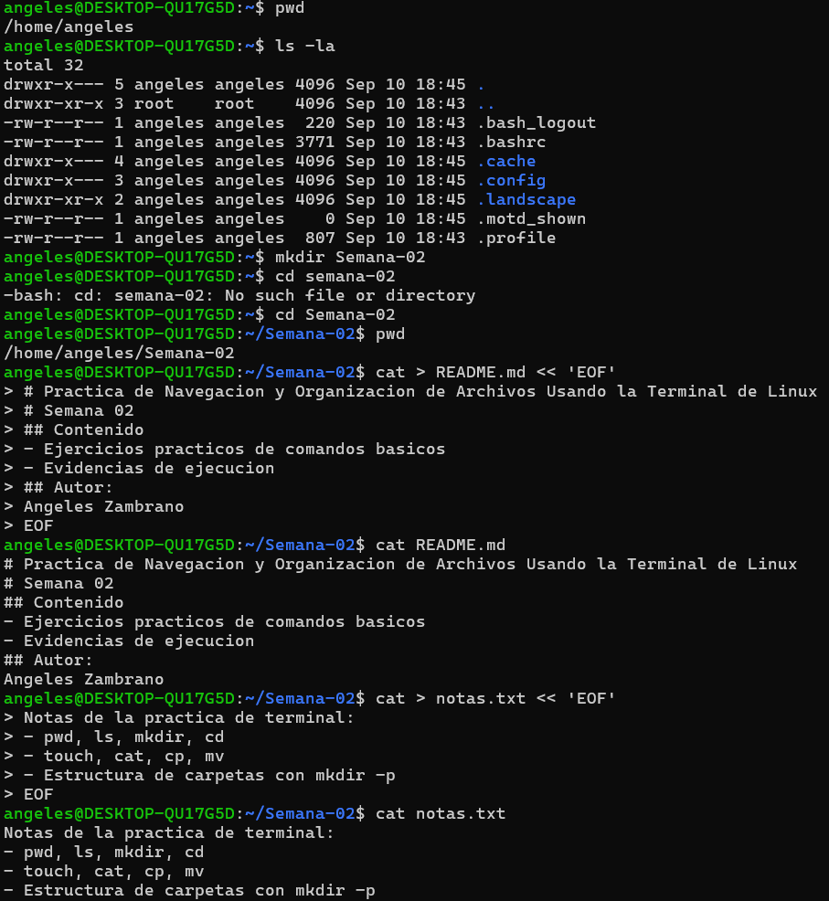
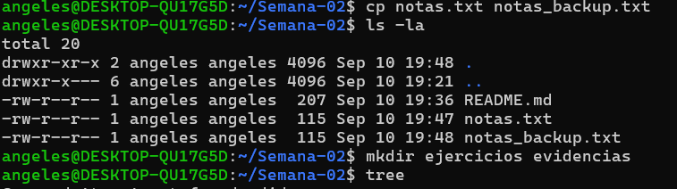
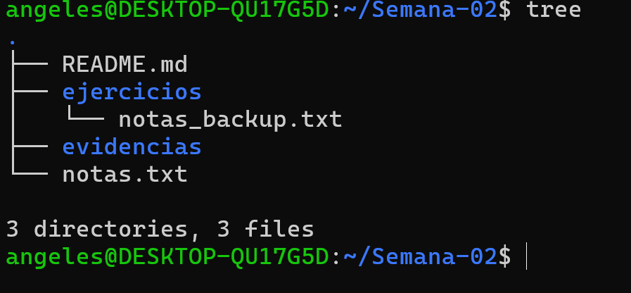

# Navegación y Organización de Archivos con Terminal Linux (WSL)
### Comandos básicos, gestión de archivos y estructura de directorios

**Estudiante:** Angeles Zambrano  
**Asignatura:** CERN  
**Actividad:** Comandos básicos de navegación y organización en terminal  
**Entorno de trabajo:** WSL – Ubuntu (`~/Semana-02`)  
**Institución:** Universidad de las Fuerzas Armadas – ESPE (Sangolquí – Ecuador, 2026)

---

## 1. Introducción

La terminal es una de las herramientas más poderosas para interactuar con un sistema operativo tipo Unix, ya que permite ejecutar tareas de administración de archivos y directorios de forma directa, rápida y reproducible. En esta actividad se utilizó un entorno WSL (Windows Subsystem for Linux) con distribución Ubuntu para practicar comandos fundamentales de navegación, creación y manipulación de archivos, así como la organización de una estructura de carpetas dentro de un directorio de trabajo llamado `Semana-02`.

Para verificar visualmente la estructura final del proyecto se instaló y ejecutó el comando tree:

```bash
sudo apt install tree -y
tree
```

obteniendo la siguiente estructura, correspondiente a lo solicitado:

```text
Semana-02/
├── README.md
├── notas.txt
├── ejercicios/
│   └── notas_backup.txt
└── evidencias/
```

Con esto se completan los tres requisitos de la actividad: navegación básica, creación y manipulación de archivos, y organización de una jerarquía de carpetas coherente dentro del proyecto.

## 2. Evidencias

A continuación se presentan las capturas de pantalla donde se observan, en orden, los comandos utilizados durante toda la práctica y el resultado final de la estructura de directorios obtenida.



*Figura 1: Navegación inicial en el sistema, creación del directorio Semana-02 y del archivo README.md con su contenido verificado mediante cat.*



*Figura 2: Copia del archivo notas.txt con cp, verificación del contenido de la carpeta con ls -la y creación de las carpetas ejercicios y evidencias.*



*Figura 3: Resultado final de la estructura del proyecto obtenida con el comando tree: README.md, notas.txt y las carpetas ejercicios (con notas_backup.txt) y evidencias.*

## 3. Reflexión final

### ¿Qué ventaja encuentras en utilizar la terminal para trabajar con archivos y proyectos?

La principal ventaja de la terminal es la rapidez y precisión con la que se pueden crear, mover, copiar y organizar archivos y carpetas, ya que una sola línea de comando reemplaza varios pasos que en una interfaz gráfica requerirían múltiples clics. A esto se suma la posibilidad de automatizar tareas repetitivas mediante scripts, el bajo consumo de recursos del sistema y la capacidad de trabajar en servidores remotos o entornos sin interfaz gráfica, donde la terminal es, muchas veces, la única forma de interactuar con el sistema. En conjunto, estas características convierten a la terminal en una herramienta esencial para cualquier persona que trabaje en el desarrollo de software o la administración de sistemas.
