# Trabajo Colaborativo en GitHub: Ramas, Pull Requests y Revisión de Código

**Universidad de las Fuerzas Armadas – ESPE**  
**Programa:** Preparación para Oportunidades CERN 2026 (PREP CERN)  
**Asignatura:** CERN  
**Actividad:** Evidencia 2 — Trabajo colaborativo en GitHub  
**Estudiante (Propietaria):** Angeles Zambrano ([@ajzambrano12-cloud](https://github.com/ajzambrano12-cloud))  
**Colaborador (Revisor):** Klever López ([@Klopezxd](https://github.com/Klopezxd))  
**Repositorio oficial:** [https://github.com/ajzambrano12-cloud/-cern-preparation-program-Angeles](https://github.com/ajzambrano12-cloud/-cern-preparation-program-Angeles)

---

> **Objetivo:** Aplicar un flujo de trabajo colaborativo profesional basado en control de versiones distribuido con Git y GitHub, mediante la creación de ramas de características (*feature branches*), el intercambio de contribuciones atómicas, la apertura de Pull Requests con revisiones de código cruzadas (*peer code review*) y la integración controlada en la rama principal (`main`), garantizando la integridad de la base de código y la documentación técnica del programa CERN.

---

## 1. Flujo de Trabajo y Arquitectura de Ramas

Para simular las dinámicas de desarrollo de software colaborativo empleadas en grandes experimentos como CMS en el CERN, se adoptó el modelo **Feature Branch Workflow**. En este esquema, la rama `main` permanece protegida contra commits directos y únicamente recibe cambios previamente validados mediante Pull Requests aprobados por otro integrante del equipo.

```mermaid
flowchart TD
    subgraph Repositorio Remoto en GitHub
        M1["main: Base limpia (Commit inicial de semana 3)"] --> B1["Rama: feature/limpieza-y-docs-semana03<br/>(Autor: @Klopezxd)"]
        B1 --> C1["Commit: Saneamiento de .gitkeep y docs iniciales"]
        C1 --> PR1["Pull Request #1: Limpieza y docs semana 03"]
        PR1 -->|Revisado y aprobado por @ajzambrano12-cloud| M2["main: Merge PR #1"]
        
        M2 --> B2["Rama: feature/actualizar-cronograma-semana03<br/>(Autora: @ajzambrano12-cloud)"]
        B2 --> C2["Commit: Actualizar tabla y enlazar PR #1"]
        C2 --> PR2["Pull Request #2: Actualización de cronograma"]
        PR2 -->|Revisado y aprobado por @Klopezxd| M3["main: Merge PR #2 (Estado sincronizado)"]
    end
```

---

## 2. Registro Comparativo de Contribuciones Cruzadas

La práctica involucró dos ciclos completos de desarrollo, revisión y fusión:

| Parámetro | Pull Request #1 | Pull Request #2 |
| :--- | :--- | :--- |
| **Título del Pull Request** | Saneamiento de estructura y documentación colaborativa | Actualización de cronograma semanal con estado colaborativo |
| **Rama de Trabajo** | `feature/limpieza-y-docs-semana03` | `feature/actualizar-cronograma-semana03` |
| **Rama de Destino** | `main` | `main` |
| **Autora / Autor del Commit** | Klever López ([@Klopezxd](https://github.com/Klopezxd)) | Ángeles Zambrano ([@ajzambrano12-cloud](https://github.com/ajzambrano12-cloud)) |
| **Revisor de Código (Reviewer)** | Ángeles Zambrano ([@ajzambrano12-cloud](https://github.com/ajzambrano12-cloud)) | Klever López ([@Klopezxd](https://github.com/Klopezxd)) |
| **Enlace en GitHub** | [Pull Request #1](https://github.com/ajzambrano12-cloud/-cern-preparation-program-Angeles/pull/1) | [Pull Request #2](https://github.com/ajzambrano12-cloud/-cern-preparation-program-Angeles/pull/2) |
| **Archivos Afectados** | `semana-03/README.md` `semana-03/ejercicios/.gitkeep` `semana-03/evidencias/.gitkeep` | `semana-03/README.md` |
| **Propósito Técnico** | Eliminación de archivos marcadores redundantes e incorporación de la sección de la Evidencia 02 en el índice de entregables. | Sincronización de la tabla del cronograma semanal marcando la actividad en estado `Completado` y enlazando el PR #1. |

---

## 3. Cuestionario Técnico de la Actividad (Moodle)

### 1. URL del repositorio
[https://github.com/ajzambrano12-cloud/-cern-preparation-program-Angeles](https://github.com/ajzambrano12-cloud/-cern-preparation-program-Angeles)

### 2. Nombre de la rama utilizada
`feature/actualizar-cronograma-semana03`

### 3. URL del Pull Request personal
[https://github.com/ajzambrano12-cloud/-cern-preparation-program-Angeles/pull/2](https://github.com/ajzambrano12-cloud/-cern-preparation-program-Angeles/pull/2)

### 4. Breve descripción de la contribución realizada
Actualicé la tabla de planificación interna en el archivo `semana-03/README.md`. En dicha modificación, sincronicé el estado de la actividad colaborativa del miércoles 16/09 a `Completado`, vinculé directamente el [Pull Request #1](https://github.com/ajzambrano12-cloud/-cern-preparation-program-Angeles/pull/1) previamente revisado y fusionado por mi parte, y aseguré la coherencia documental del módulo antes de integrar los cambios a la rama `main`.

### 5. Dificultad técnica encontrada y solución aplicada
La principal dificultad radicó en la transición operativa entre la terminal local y la interfaz gráfica de GitHub al momento de gestionar el Pull Request. Tras publicar la rama con `git push -u origin feature/actualizar-cronograma-semana03`, el banner emergente de comparación rápida (*"Compare & pull request"*) no se desplegó de forma inmediata en el navegador debido al refresco de sesión. 

Para resolverlo sin generar inconsistencias, se navegó de forma manual a la pestaña **Pull Requests**, se seleccionó **New pull request**, y se especificó explícitamente la rama base (`base: main`) y la rama de comparación (`compare: feature/actualizar-cronograma-semana03`). Se verificó la ausencia de conflictos de fusión (*"Able to merge"*) y se inspeccionó el *diff* unificado antes de transferir la solicitud a revisión por parte del colaborador.

---

## 4. Fundamentación Técnica en Tecnologías de la Información

El desarrollo colaborativo mediante Git y GitHub no constituye únicamente una práctica organizativa, sino un estándar fundamental de la ingeniería de software y la ciencia de datos moderna:

1. **Aislamiento y Protección del Código (`main` estable):**  
   Trabajar sobre ramas independientes garantiza que las funcionalidades en desarrollo, pruebas experimentales o ajustes documentales no comprometan la estabilidad de la rama troncal utilizada para despliegues o revisiones académicas.
2. **Revisión por Pares (*Peer Review*) y Control de Calidad:**  
   La inspección del código por un segundo par técnico permite detectar inconsistencias de formato, errores lógicos o enlaces rotos antes de la incorporación definitiva al repositorio central.
3. **Trazabilidad y Auditoría Técnica:**  
   Cada Pull Request documenta el contexto del cambio, los participantes involucrados, los comentarios de retroalimentación y los hashes criptográficos de cada commit, garantizando una bitácora inalterable del progreso del proyecto.
4. **Reproducibilidad Científica en el CERN:**  
   En experimentos de física de altas energías con cientos de colaboradores interactuando sobre marcos de análisis comunes (como CMSSW, ROOT y NanoAOD), el flujo estricto de Pull Requests previene la sobreescritura accidental de algoritmos de selección y asegura la reproducibilidad de los resultados publicados.
