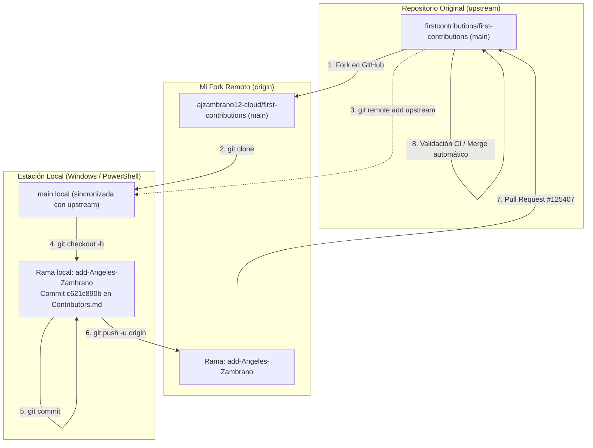

# Primera Contribución Open Source en GitHub

**Universidad de las Fuerzas Armadas – ESPE**  
**Programa:** Preparación para Oportunidades CERN 2026 (PREP CERN)  
**Asignatura:** CERN  
**Actividad:** Evidencia 1 — Primera contribución Open Source  
**Estudiante:** Angeles Zambrano ([@ajzambrano12-cloud](https://github.com/ajzambrano12-cloud))  
**Proyecto:** [firstcontributions/first-contributions](https://github.com/firstcontributions/first-contributions)  
**Pull Request:** [#125407](https://github.com/firstcontributions/first-contributions/pull/125407)  
**Estado:** `Merged` (Fusionado en la rama `main` del repositorio oficial)

---

> **Objetivo:** Comprender y aplicar de forma práctica el flujo de trabajo estándar para contribuciones de código abierto en GitHub (*Forking Workflow*), mediante la bifurcación de un repositorio público, la configuración de remotos `origin` y `upstream`, la creación de ramas de características aisladas, la realización de commits atómicos y la apertura de un Pull Request sujeto a validación automatizada por parte de los mantenedores.

---

## 1. Arquitectura del Flujo Forking Workflow

En proyectos de código abierto a gran escala —como los desarrollados por la colaboración CMS en el CERN— los desarrolladores no tienen permisos de escritura directos sobre el repositorio central. En su lugar, se emplea el modelo **Forking Workflow**:

---

## 2. Registro de Ejecución Técnica

| Parámetro | Detalle de la Contribución |
| :--- | :--- |
| **Repositorio Destino** | `firstcontributions/first-contributions` |
| **Repositorio Fork** | `ajzambrano12-cloud/first-contributions` |
| **Rama de Trabajo** | `add-Angeles-Zambrano` |
| **Archivo Modificado** | `Contributors.md` |
| **Cambio Aplicado** | Inclusión de enlace de perfil en formato Markdown: `+ [Angeles Zambrano](https://github.com/ajzambrano12-cloud) My first contribution c:` |
| **Métricas del Commit** | 1 archivo modificado, 1 inserción (`+`), 0 eliminaciones (`-`) |
| **Identificador del Commit** | `c621c890b` (*"Add Angeles Zambrano to Contributors list"*) |
| **Pull Request Oficial** | [PR #125407](https://github.com/firstcontributions/first-contributions/pull/125407) |
| **Resolución del PR** | Aprobado y fusionado exitosamente por `github-actions[bot]` |

---

## 3. Cuestionario de Entrega (Moodle)

### 1. Proyecto en el que realizaste la actividad
Se colaboró en el proyecto de código abierto **First Contributions** (`firstcontributions/first-contributions`), un repositorio comunitario internacional diseñado para estandarizar y guiar el proceso de contribución mediante Git y GitHub.

### 2. Enlace a tu Pull Request
[https://github.com/firstcontributions/first-contributions/pull/125407](https://github.com/firstcontributions/first-contributions/pull/125407)

### 3. Pasos realizados desde el inicio hasta el envío
1. **Fork del proyecto:** Creación de una copia del repositorio oficial bajo la cuenta personal `@ajzambrano12-cloud`.
2. **Clonación local:** Clonación del fork en el equipo local (`C:\Users\Angel\proyectos\first-contributions`) y vinculación del repositorio original como remoto `upstream`.
3. **Aislamiento en rama:** Creación de la rama `add-Angeles-Zambrano` mediante `git checkout -b` a partir de `main` actualizada.
4. **Edición atómica:** Incorporación del nombre y enlace de perfil al final de `Contributors.md`.
5. **Confirmación y publicación:** Generación del commit `c621c890b` y envío al fork remoto mediante `git push -u origin add-Angeles-Zambrano`.
6. **Apertura y seguimiento del PR:** Creación del Pull Request hacia la rama `main` del repositorio base, completando la plantilla requerida. El PR fue verificado sin conflictos y fusionado por el bot del proyecto.

### 4. Aprendizajes sobre la colaboración mediante GitHub
Se consolidó la comprensión del **Forking Workflow**, modelo estándar en proyectos *Open Source* y organizaciones científicas donde no se otorga acceso directo de escritura a la rama principal. Aprendí la importancia de mantener dos remotos (`origin` para el trabajo personal y `upstream` para sincronizar cambios del proyecto central), la necesidad de realizar commits atómicos que afecten únicamente las líneas pertinentes, y el rol de las herramientas de integración continua (CI) que auditan automáticamente las contribuciones.

### 5. Dificultades encontradas y resolución técnica
* **Error de marcador en la URL:** Durante la clonación inicial se copió textualmente el marcador `<TU-USUARIO>` de la guía, generando el error `Repository not found`. Se corrigió sustituyéndolo por el usuario real `@ajzambrano12-cloud`.
* **Interpretación de sintaxis en PowerShell:** Al intentar escribir la línea de Markdown directamente desde la consola, PowerShell interpretó los corchetes `[Angeles Zambrano]` como una invocación de tipo .NET (`No se encuentra el tipo [Angeles]`). Para evitar errores de escape en la terminal, se abrió `Contributors.md` en un editor de texto plano para insertar la línea de forma limpia.

---

## 4. Fundamentación Técnica en Tecnologías de la Información

1. **Descentralización y Control de Accesos:**  
   A diferencia del flujo colaborativo en un mismo repositorio (empleado en la Semana 3), el modelo *fork-and-pull* traslada la carga de cambios a repositorios derivados, preservando intacto el código base oficial.
2. **Integración Continua y Bots Mantenedores:**  
   En proyectos con miles de contribuciones concurrentes, la automatización mediante GitHub Actions valida sintaxis, formateo y ausencia de conflictos antes de permitir el merge, optimizando la labor de los mantenedores humanos.
3. **Relevancia para la Computación en el CERN:**  
   Los frameworks científicos del CERN (como CMSSW, ROOT y librerías de Scikit-HEP) operan bajo este mismo paradigma en GitHub: cualquier investigador o estudiante propone correcciones de errores, mejoras de algoritmos o nuevos paquetes mediante Pull Requests desde su propio fork.
